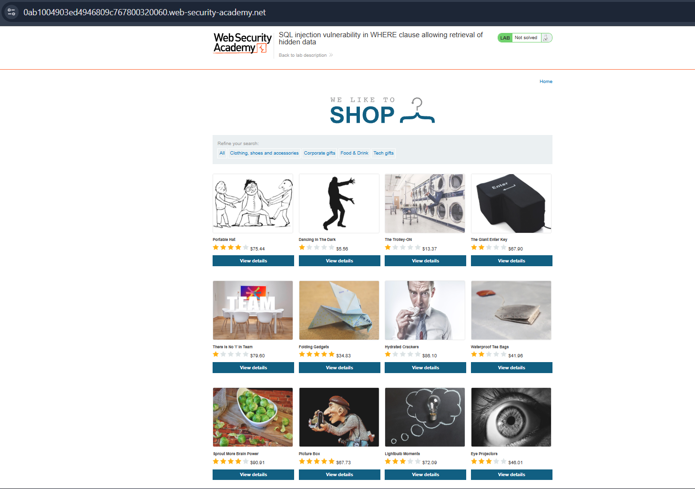

# Lab 1 — SQL Injection Vulnerability in WHERE Clause

## Lab Description

**PortSwigger Web Security Academy**

**Lab:** SQL injection vulnerability in WHERE clause allowing retrieval of hidden data

---

## Objective

The objective of this lab is to perform a **SQL Injection** attack that causes the application to display one or more unreleased products.

---

## Initial Application

The application contains different product categories. When a category is selected, the application sends the selected category as a parameter in the URL.



---

## Identifying the Vulnerable Parameter

For example, selecting the **Tech Gifts** category results in a URL containing the category parameter.


The `category` parameter is therefore a potential point for testing SQL Injection.

---

## Understanding the SQL Query

The application uses the following SQL query to retrieve products:

```sql
SELECT * 
FROM products 
WHERE category = 'Tech Gifts' 
AND released = 1;
```

The important part of the query is:

```sql
category = 'Tech Gifts' AND released = 1
```

The `released = 1` condition ensures that only released products are displayed.

The goal is to manipulate the query so that this restriction is bypassed.

---

## SQL Injection Payload

The following payload can be supplied through the `category` parameter:

```text
' OR 1=1--
```

### Injected Query

The original query:

```sql
SELECT *
FROM products
WHERE category = 'Tech Gifts'
AND released = 1;
```

After injecting the payload, the query effectively becomes:

```sql
SELECT *
FROM products
WHERE category = 'Tech Gifts'
' OR 1=1--'
AND released = 1;
```

Conceptually, the important part of the injection is:

```sql
' OR 1=1--
```

### How the Payload Works

#### `'`

The single quote terminates the original string value.

#### `OR`

Adds an alternative condition to the SQL statement.

#### `1=1`

This condition is always **TRUE**.

```sql
1 = 1
```

is always true, regardless of the database contents.

#### `--`

The double hyphen is used to begin a SQL comment in the relevant SQL syntax.

This causes the remaining part of the query to be ignored.

As a result, the original:

```sql
AND released = 1
```

restriction can effectively be bypassed.

---

## Exploitation

The payload is inserted into the `category` parameter of the URL:

```text
' OR 1=1--
```

The resulting SQL condition becomes logically equivalent to a condition that is always true.

Therefore, the application is no longer restricted to displaying only the selected category or only released products.

---

## Result

After submitting the SQL Injection payload, the application displays products that were previously hidden.


The application therefore reveals both **released and unreleased products**, demonstrating successful SQL Injection.

---

## Why the Attack Works

The application directly incorporates user-controlled input into a SQL query without properly separating data from SQL syntax.

The original query contains:

```sql
WHERE category = 'Tech Gifts'
AND released = 1
```

By injecting:

```text
' OR 1=1--
```

the attacker changes the logic of the SQL statement.

Because:

```sql
1=1
```

is always true, the `WHERE` condition can be manipulated to return additional records.

---

## Key Takeaways

* User-controlled input should never be directly concatenated into SQL queries.
* SQL Injection can allow attackers to manipulate the application's database queries.
* Boolean conditions such as `1=1` can be used to alter query logic.
* SQL comments can be used to ignore the remaining portion of a vulnerable query.
* Proper **parameterized queries / prepared statements** should be used to prevent SQL Injection.

---

## Lab Status

**Solved ✅**

**Vulnerability:** SQL Injection

**Injection Point:** `category` URL parameter

**Payload:**

```text
' OR 1=1--
```

